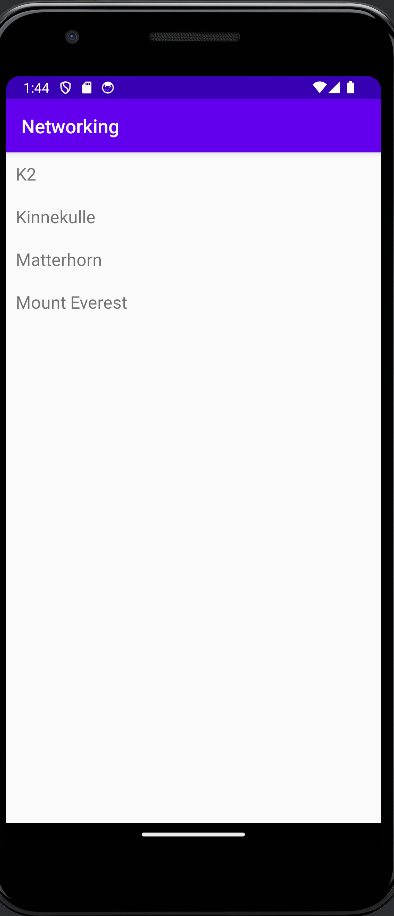

# Rapport

```
 public void onPostExecute(String json) {
        Log.d("MainActivity", json);

        Type type = new TypeToken<ArrayList<mountain>>() {}.getType();
        ArrayList<mountain> mountains = gson.fromJson(json, type);

        RecyclerView recycler_view = findViewById(R.id.recycler_view);

        recyclerviewadapter adapter = new recyclerviewadapter (this, mountains);
        recycler_view.setAdapter(adapter);
        recycler_view.setLayoutManager(new LinearLayoutManager(this));
        adapter.notifyDataSetChanged();

    }
```
För uppgiften skulle data hämtas från en webbservice. Genom att först kolla igenom datan som fanns på sidan 
kunde en klass skapas där egenskaperna i JSON blev namn på variabler som ska hålla respektive data. 
Efter detta skapades en ny klass och en ny layout XML för recycler view och en adapter för att kunna tolka JSON data till recycler view. 
I recycler view klassen kopplas textView och data tillsammans och om det skulle finnas andra widgets skulle dessa bli tilldelade data i denna klass också.
Här kopplade även dess layout för att vid utskrivning, kunna visa data. Recycler view kallas efter det i MainActivity i för att kunna skriva ut datan. 

Det som händer i MainActivity är att ta fram layouten för endast MainActivity eftersom det finns en egen layout för recycler view.
I "onPostExecute" används också GSON för att hämta och öppna upp data som hämtats från URL:en. Koden efter det förklarades tidigare
där recycler view används för att skriva ut den datan som den håller på, det är detta som koden ovan också visar. 


#### Screenshot


